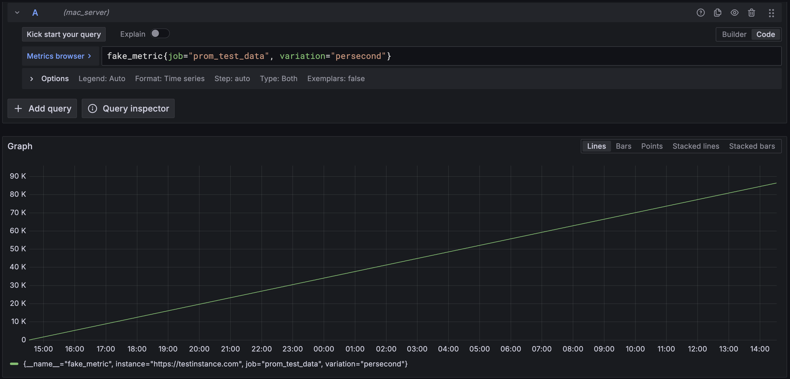
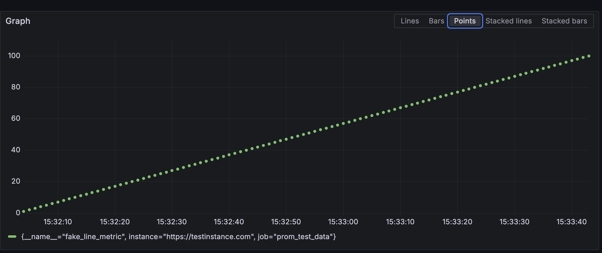
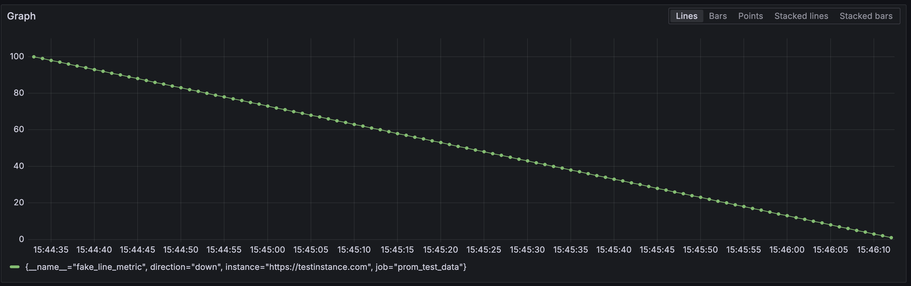
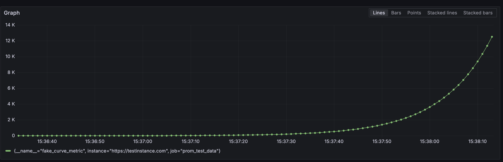
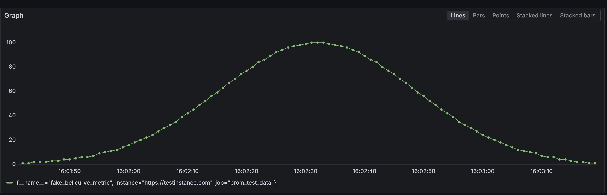
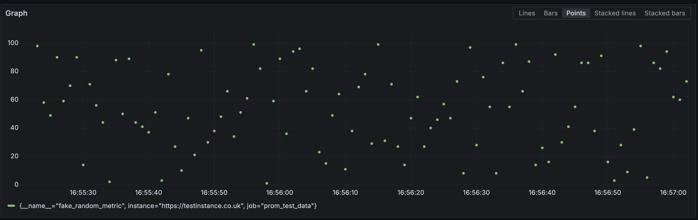
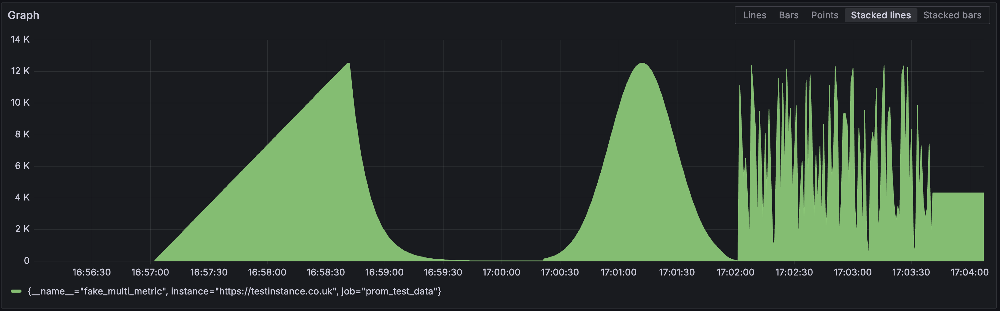

# Prom Test Data

_This is in a very pre-alpha state and the api is being actively worked upon. Contributions are happily accepted!_

Prom Test Data is a tool that is designed to be able to create 'hand-crafted' metrics for Prometheus with a simple JavaScript api.

```JavaScript
import { writeWithLog } from "../helpers/write/writeWithLog.ts";

writeWithLog({
  samples: sampleFromTime({
    shapes: [
      {
        type: `line`,
        range: [0, 86400],
      }
    ],
    time: {
      start: new Date().getTime(),
      end: new Date().getTime() = - ONE_DAY_IN_MS,
      interval: 1000,
    }
  }),
  labels: {
    __name__: `fake_metric`,
    job: "prom_test_data",
    instance: "https://testinstance.com",
    variation: `persecond`
  }
})
```



## Motivation

I created this tool because I am new to Prometheus and PromQL and I wanted to have the ability to bulk create metrics that I could use to test our Grafana Synthetic Monitoring application more fully whilst learning about Prometheus and PromQL.

The initial problems I faced before creating this tool are multi-faceted:
- I needed to understand the underlying data fully to confirm if the PromQL I was writing was what I needed.
  - There is a catch-22 when learning PromQL -- the only way to test if your queries are correct is by writing more PromQL.
- I needed to test queries that had fully formed metrics that stretched back in time as far as a year.
- I needed to create various scenarios in the extreme and see how Prometheus and PromQL would handle them.
- I am a hands-on learner that learns best by extrapolation and trial and error.

My end goal of this tool is to intergate it into our CI/CD pipelines for our Grafana plugin so that we can have full e2e tests for the visualizations and other Mimir-dependant features across the application.

## Who is this for

This tool is ideal for people who want to:
- Increase their Prometheus and PromQL knowledge by having full control over the underlying data
- Create any amount of fake metrics for testing purposes

## Getting started

1. Clone the repository
2. `npm install` to install the minimal dependencies
3. `npm run prom` to start the Prometheus server in the docker-compose file
4. `npm run prom:testdata` to backfill some test data into the Prometheus server

The Prometheus server will be running on [http://localhost:9090](http://localhost:9090). To see if your test data populated correctly, you can navigate directly to [this link](http://localhost:9090/query?g0.expr=fake_metric&g0.show_tree=0&g0.tab=graph&g0.range_input=1d&g0.res_type=auto&g0.res_density=high&g0.display_mode=lines&g0.show_exemplars=0).

### Setting up a Prometheus Datasource in a local Grafana instance

These instructions assume you will be running Grafana locally.

1. Navigate to 'Data Sources' in the side menu
2. Click 'Add new data source'
3. Select 'Prometheus'
4. Name your data source as appropriate
5. For the Prometheus server URL:
    - If you are running Grafana outside of a docker container, use `http://localhost:9090`
    - If you are running Grafana in a docker container, use `http://host.docker.internal:9090`
6. Click 'Save & Test'

You should see a green notification that says 'Successfully queried the Prometheus API'.

You can now navigate to the 'Explore' tab in the side menu and start visualizing your fake metrics.

## Writing data

There are two methods to get data into the Prometheus server:
1. Remote write
2. Backfilling

Remote write is very limiting, where as backfilling is a lot more flexible. Currently the `writeWithLog` method evaluates the samples and chooses which method is appropriate to use. If the time frame of the samples is less than 10 minutes it will use remote write, otherwise it will use backfilling.

_This is because you can use remote write to enter metrics into your Grafana Cloud Mimir instance. It doesn't currently support backfilling so that's why I left both ways open. There is an options block you can add to force which method the write function should use._

The primary method to write fake metrics to your Prometheus instance is `writeWithLog` function. This will both write your metrics to Prometheus and write a json log file to the `./logs` directory with useful information about what was written, including human-readable timestamps for each of the metrics.

When using the backfill method, `writeWithLog` will convert your metrics to an [OpenMetrics format](https://github.com/prometheus/OpenMetrics/blob/main/specification/OpenMetrics.md) which will then get written to the `src/docker/input` folder. Prometheus' `promtool` and `tsdb create-blocks-from openmetrics` command will then be invoked automatically with the path to the newly created file. This will create a block in `src/docker/blocks` folder which will then get scrapped and backfilled into Prometheus. There is sometimes a bit of a delay between when the block gets created and the metrics appearing in Prometheus (usually less than a minute at most dependant on the data you are writing).

### How to write data

This tool is written entirely in TypeScript and the scripts run in a node environment => 22.11.0. To write data, simply write a script as needed then run it by either invoking `tsx ./path-to-your-script.ts` or using `npm start ./path-to-your-script.ts`.

See the example at the top of this document or in [src/scripts/writeTestMetrics.ts](./src/scripts/writeTestMetrics.ts) to see what to include in your script.

### How to create metrics

Metrics require three things:
1. Samples
2. Labels
3. Metadata

#### Samples

Samples are the data points that you want to write to Prometheus. They are an array of objects that have a `value` and a `timestamp` property. The `timestamp` property should be a unix timestamp in milliseconds.

```JavaScript
const samples = [
  {
    value: 1,
    timestamp: 1738247466
  },
  {
    value: 2,
    timestamp: 1738247467
  }
]
```

On face value this is incredibly simple. The core of this tool is aimed at how to craft a huge amount of __predictable__ samples that you can generate with a simple api.

##### Thinking in shapes

When creating the values for your samples, you can break down the process into thinking about what 'shape' the data will form which you want to use:

1. __Line__: A straight line from one point to another

```Javascript
{
  type: `line`,
  range: [1, 100],
  entries: 100
}
```

"Draw a line from 1 to 100 with 100 entries".


See this example by running `npm start ./src/scripts/examples/writeCurve.ts`

To inverse the line, simply swap the range values as they represent the start and end points of the shape:

```Javascript
{
  type: `line`,
  range: [100, 1],
  entries: 100
}
```

"Draw a line from 100 to 1 with 100 entries".




2. __Curve__: A curve that increases exponentially

```Javascript
{
  type: `curve`,
  range: [1, Infinity],
  entries: 100,
  attrs: {
    rate: 0.1,
  }
}
```

"Draw a curve starting at 1 and grow every entry by 10% for 100 entries with no maximum limit."



See this example by running `npm start ./src/scripts/examples/writeCurve.ts`

To inverse the curve, simply swap the range values as they represent the start and end points of the shape.

3. __Bellcurve__: A bellcurve that increases exponentially then decreases exponentially

```Javascript
{
  type: `bellCurve`,
  range: [1, 100],
  entries: 100,
  attrs: {
    curvePeakAt: 50,
    normalizeAt: 90,
    stdDevFactor: 6
  }
}
```
"Draw a bellcurve starting at 1 and goes up to 100. The peak of the curve is at the halfway point (50%) and the curve will normalize at 90%, utilizing 6 factors of standard deviation."



See this example by running `npm start ./src/scripts/examples/writeCurve.ts`

The bell curve's shape can change in multiple ways by adapting the three attributes.

4. __Random__ A random set of values

```Javascript
{
  type: `random`,
  range: [1, 100],
  entries: 100
}
```

"Draw random points between 1 and 100 for 100 entries."



###### Combining shapes

Now you have the base shapes, you can combine them to create more complex shapes.



An ascendant line, followed by a descendant curve, followed by a bellcurve before ending on a random data set.

##### Two ways to create samples

When creating samples, there are two ways to orientate yourself:
1. How many entries do you want to create? Calculate the time period to cover from this.
2. What time period do you want to cover? Calculate how many entries to create from this.

There is a universal helper function `createSamples` that will take care of this for you. It will assess your input and infer the time period and entries needed to create the samples. If you have provided insufficient information, it will throw an error.

1. Calculate the amount of entries needed to cover the time period with the specified interval

```Javascript
  createSamples({
    shapes: [
      {
        type: `random`,
        range: [100, 300],
      },
    ],
    time: {
      end: new Date(`2024-01-02`).getTime(),
      start: new Date(`2024-01-01`).getTime(),
      interval: ONE_MINUTE_IN_MS,
    },
  })
```

This will create a random set of data points between 100 and 300 over a 24 hour period. There will be 1441 entries in total (1440 minutes in a day + 1 due to starting and finishing at midnight).

2. Calculate the time period needed to cover the amount of entries with the specified interval

```Javascript
  createSamples({
    shapes: [
      {
        type: `line`,
        range: [1, 24],
        entries: 24,
      },
    ],
    time: {
      end: new Date(`2024-01-02`).getTime(),
      interval: ONE_HOUR_IN_MS,
    },
  })
```

This will create 24 entries as an ascendant line from 1 to 24 equally spaced every hour, ending at midnight on the 2nd of January 2024. It will calculate the first entry is at 01:00am on the 1st of January 2024.

You can swap the `end` property for a `start` property to calculate from the start time of the samples instead.

3. Calculate the interval needed to cover the time period with the specified amount of entries

```Javascript
  createSamples({
    shapes: [
      {
        type: `line`,
        range: [1, 24],
        entries: 24,
      },
    ],
    time: {
      end: new Date(`2024-01-02`).getTime(),
      start: new Date(`2024-01-01`).getTime() + ONE_HOUR_IN_MS,
    },
  })
```

This will end up as the same result as above but you can see how the interval is calculated from the start and end times and the amount of entries.
